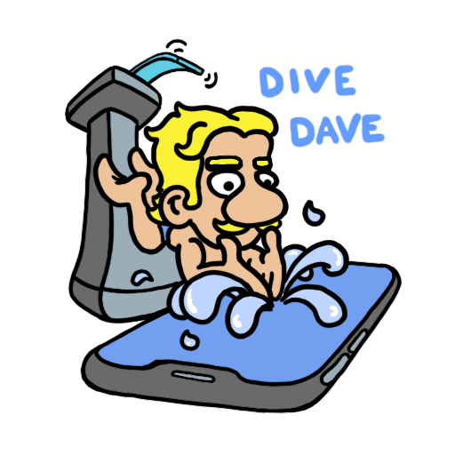
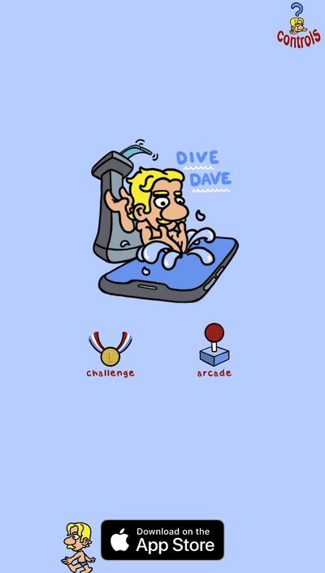

# dive dave

A small diving game. Pick a board, time the spring, spin in the air, hit the water clean.

Two parallel implementations that play identically:

- **[`divedave-web/`](divedave-web/)** — Phaser 4 / JavaScript. Runs in any modern browser.
- **[`divedave-ios/`](divedave-ios/)** — SpriteKit / Swift. Native iOS app.

## Play it

[Live demo (web)](https://drawvid.com/code/divedave/)

## Repo layout

| Path                     | What's there                                                                     |
| ------------------------ | -------------------------------------------------------------------------------- |
| `divedave-web/`          | Phaser 4 build. See [its README](divedave-web/README.md) for run/build details.  |
| `divedave-ios/`          | SpriteKit/Swift build. See [its README](divedave-ios/README.md) for Xcode setup. |
| `promo/`                 | Screen recordings and gifs used in posts.                                        |
| [`PARITY.md`](PARITY.md) | What's kept in sync between the two codebases, and what intentionally differs.   |
| [`CLAUDE.md`](CLAUDE.md) | Rules for AI coding assistants working in this repo.                             |
